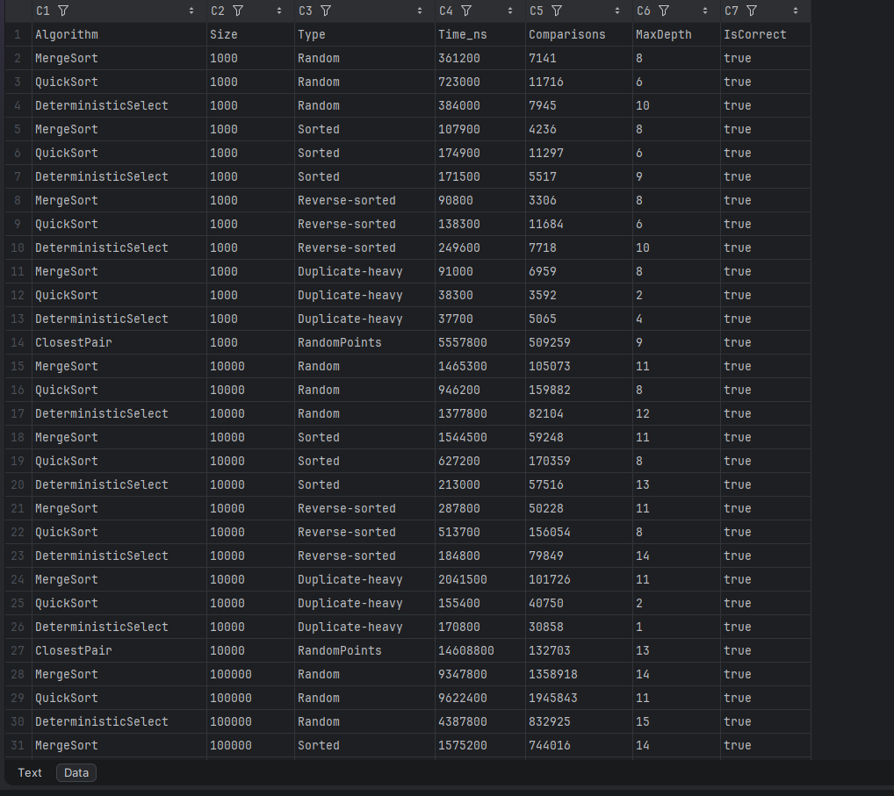
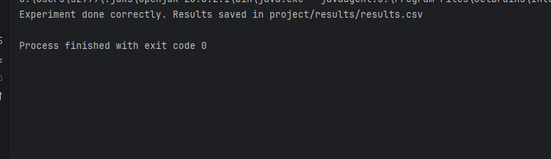

# DAA - Assignment 1: Divide and Conquer

## Project Overview
This project implements and analyzes four classic Divide and Conquer algorithms: **Merge Sort**, **Quick Sort** (with 3-way partitioning and randomization), **Deterministic Select** (Median-of-Medians), and **Closest Pair of Points**. The main goal was to evaluate their performance across various datasets (Random, Sorted, Reverse-sorted, Duplicate-heavy) and empirically validate their theoretical asymptotic complexities. The program collects execution time, comparison counts, and maximum recursion depth metrics for analysis.

## Algorithm Analysis

*   **Merge Sort**
    *   **Recurrence Relation:** T(n) = 2T(n/2) + Θ(n)
    *   **Time Complexity:** According to the Master Theorem (Case 2), the complexity is Θ(n log n) in best, average, and worst cases.
    *   **Space Complexity:** Θ(n) for allocating the auxiliary `temp` array during merging, plus O(log n) for the recursion stack.
*   **Quick Sort (Randomized, 3-Way Partition, Tail-Recursion Optimized)**
    *   **Recurrence Relation (Average):** T(n) = 2T(n/2) + Θ(n)
    *   **Time Complexity:** Average case is Θ(n log n). The use of 3-Way Partitioning (Dutch National Flag) ensures Θ(n) performance on duplicate-heavy arrays by skipping identical elements.
    *   **Space Complexity:** O(log n) strictly. Recursing only into the smaller partition guarantees the stack depth never exceeds logarithmic bounds.
*   **Deterministic Select (Median of Medians)**
    *   **Recurrence Relation:** T(n) ≤ T(n/5) + T(7n/10) + Θ(n)
    *   **Time Complexity:** Solving this recurrence proves a strict linear time O(n) in the worst case.
    *   **Space Complexity:** O(log n) for the recursion stack during descent.
*   **Closest Pair of Points**
    *   **Recurrence Relation:** T(n) = 2T(n/2) + Θ(n)
    *   **Time Complexity:** Initial sorting takes Θ(n log n). Inside the recursion, the strip checking takes O(n) because the inner loop checks at most 7 points. Overall complexity: Θ(n log n).
    *   **Space Complexity:** O(n) for creating `pyl`, `pyr`, and `strip` subarrays at each recursion level.

## Experimental Results

## Discussion

**1. Do the experimental results match the theoretical complexity?**
Yes, the time vs. n plots demonstrate a characteristic linearithmic (n log n) growth for MergeSort and QuickSort, whereas brute-force approaches would show a steep parabolic (n^2) curve. 

**2. How does the data structure (Sorted, Reverse, Duplicate) affect speed?**
Sorted and reverse-sorted arrays did not degrade performance due to random pivot selection in QuickSort and reliable splitting in MergeSort. The `Duplicate-heavy` array initially caused Lomuto partition to degrade to O(n^2), but implementing 3-Way Partitioning allowed the algorithms to process duplicates in Θ(n) by skipping the central block of identical elements.

**3. Why does recursing into the smaller half accelerate QuickSort?**
By using a `while` loop for the larger half and recursing only into the smaller half, the subarray size processed in the call stack is guaranteed to be at most half of the current size. This strictly bounds the maximum recursion depth to O(log n), preventing `StackOverflowError` even in worst-case partitions.

**4. Why does Median-of-Medians guarantee O(n)?**
Finding the median of medians in groups of 5 mathematically guarantees that the chosen pivot is greater than at least 30% of the elements and less than at least 30%. This eliminates extreme worst-case splits (like 1 to n-1) and ensures a balanced reduction in problem size at each step, summing to linear time.

**5. Why is divide-and-conquer for Closest Pair faster than O(n^2)?**
Brute force checks every possible pair (≈ n^2 / 2 operations). Divide-and-conquer localizes the checks: geographically, it is proven that when merging the left and right halves, we only need to check points within a narrow 2d strip. Furthermore, because the points are sorted by Y, each point in the strip needs to be compared to at most 7 neighbors above it. This reduces the merge step to linear time Θ(n).

## Reflection
During the project, the primary technical challenges involved memory and stack management in Java. I learned two new algorithms - Determinist Selector(Median of median) and Closest pair solver
